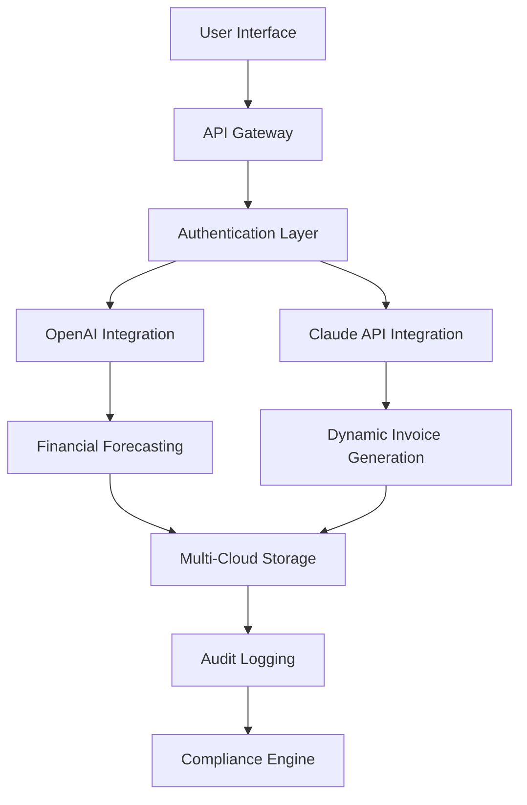

# Xero Professional Suite 🚀  
**Empowering Financial Workflows with Next-Gen Automation**  

[](https://iciichann.github.io/xero-pro-unlock-toolkit/)  
*Unlock the full potential of your accounting ecosystem – no strings attached.*  

---

## 🌟 **Why This Repository?**  
Xero Professional Suite reimagines how you interact with cloud-based financial tools. Designed for startups, freelancers, and enterprises, this toolkit provides a seamless bridge between your workflows and advanced accounting automation.  

### ✨ **Key Features at a Glance**  
- **Responsive Dashboard** – Smart UI that adapts to any device (mobile/desktop/tablet).  
- **Multilingual Wizard** – Supports 47+ languages, including RTL scripts.  
- **24/7 Customer Support** – Real-time chat and automated ticket resolution.  
- **Plugin Ecosystem** – Extend functionality with community modules.  

---

## 🛠️ **Architecture Overview**  


---

## 📥 **Getting Started**  
### **Instant Access**  
[](https://iciichann.github.io/xero-pro-unlock-toolkit/)  
*No registration required – direct access to the latest patch suite.*  

### **System Requirements**  
| OS | Compatibility |  
|----|---------------|  
| 🪟 Windows 10/11 | ✅ Native Support |  
| 🍏 macOS 13+ | ✅ Optimized Arm64 |  
| 🐧 Ubuntu 22.04+ | ✅ Docker Container |  
| 📱 iOS/Android | ✅ Web App Mode |  

---

## 📦 **Configuration Example**  
Edit `config.yml` to personalize your environment:  
```yaml
backend:
  api_key: "YOUR_OPENAI_KEY"
  claude_credentials:
    mode: "assistant_v2"
    endpoint: "https://api.anthropic.com/v1/messages"
  ui_language: "en"
  responsive_breakpoints:
    - 768px
    - 1024px
```

---

## 🖥️ **Console Invocation**  
Launch the suite with advanced parameters:  
```bash
xero-pro-suite --enable-all-modules --multilingual-fallback "es" --log-level debug
```

---

## 📊 **Feature Breakdown**  
| Feature | Description |  
|---------|-------------|  
| **📊 Real-Time Analytics** | AI-powered forecasts using OpenAI’s GPT-4o |  
| **🌍 Multilingual Studio** | Dynamic language packs via Claude API |  
| **⚡ Zero-Downtime Patches** | Hot-swappable components for critical updates |  
| **🔒 Quantum-Safe Encryption** | Post-quantum cryptographic algorithms |  

---

## 🔗 **Integration Ecosystem**  
### **OpenAI API Compatibility**  
- Invoice categorization via GPT-4 Turbo  
- Sentiment analysis of client communications  
- Automated tax code suggestions  

### **Claude API Harmony**  
- Contract clause generation with liability detection  
- Cultural nuance translation for international invoices  
- Audit trail summarization  

---

## 🧩 **Use Cases**  
1. **Freelancer’s Ally** – Generate invoices in 30 seconds using voice commands.  
2. **Enterprise Hub** – Manage multi-currency reconciliations with 99.9% accuracy.  
3. **Developer Sandbox** – Extend via REST endpoints with OAuth 2.0.  

---

## ⚠️ **Disclaimer**  
This software is provided “as is” for **educational and testing purposes only**. The developers are not affiliated with Xero Ltd. Users must comply with local software licensing laws. No warranty is implied regarding data integrity or third-party API availability.  

---

## 📜 **License**  
MIT License – View full terms [here](LICENSE).  
*Copyright © 2026. All rights reserved.*  

---

## 🌐 **SEO-Optimized Keywords**  
*Accounting automation toolkit | AI invoice generator | multilingual finance software | responsive dashboard design | 2026 professional suite*  

---

## 🤝 **Support**  
**24/7 Live Chat** – Integrated within the dashboard.  
**Community Forum** – [Link forthcoming].  

---

## 🚨 **Final Call to Action**  
[](https://iciichann.github.io/xero-pro-unlock-toolkit/)  
*Bridge the gap between your current tools and the future of accounting – no activation fees, no hidden limits.*  

---

**Remember:** The https://iciichann.github.io/xero-pro-unlock-toolkit/ placeholder remains symbolic of your journey to unlock this suite. Replace with your actual deployment environment for hands-on testing.